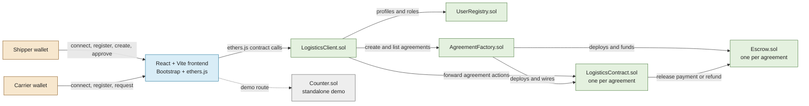

# BMIS2003 Blockchain Application Development Assignment 202605

## Decentralized Escrow and Milestone-Based Logistics Platform

A blockchain-based logistics application for managing agreements between shippers and carriers. Native ETH is deposited into a contract-controlled escrow and released progressively as milestone checkpoints are completed.

> **Project status:** Functional local and deployed Ganache prototype

## Specs Introduction: Escrow

The platform uses a smart-contract escrow model to reduce payment risk in logistics transactions:

1. A shipper and carrier register through the application and receive role-based profiles.
2. A registered shipper creates an agreement with milestones, deadlines, checkpoints, and payout percentages.
3. The full payout is sent as native ETH when the agreement is created and is locked in a dedicated escrow contract.
4. The carrier requests checkpoint approval as work progresses.
5. The shipper approves completed checkpoints. When every checkpoint in a milestone is approved, that milestone's payout is released to the carrier.
6. If the shipper terminates the active agreement or a milestone deadline fails, the remaining escrow balance is refunded to the shipper.

Each agreement is represented by a `LogisticsContract` and a paired `Escrow` contract deployed by `AgreementFactory`.

## Features

- MetaMask wallet connection through ethers.js.
- Shipper and carrier registration with profile and role validation.
- Unique user names and wallet-based user profiles.
- Milestone agreements with configurable titles, deadlines, checkpoints, and payout percentages.
- Automatic deployment and funding of an escrow for each agreement.
- Carrier checkpoint requests and shipper checkpoint approvals.
- Progressive ETH payouts to carriers after milestone completion.
- Agreement termination and escrow refunds.
- Agreement status, milestone status, and transaction history tracking.
- Deadline checks and local simulated-date support for demonstrations.
- React/Vite interface styled with Bootstrap, React-Bootstrap, and Bootswatch.
- Standalone Counter and checkpoint integration demo routes.

## Business Policy

- Users must register before participating in agreements.
- A user can register only once, and each display name must be unique.
- Only registered shippers can create agreements; the selected counterparty must be a registered carrier.
- A shipper cannot select the same wallet as both shipper and carrier.
- The shipper and carrier must negotiate and mutually agree on the escrow terms before the agreement is created.
- An agreement must specify the shipper, carrier, total escrow amount, duration, milestones, checkpoints, and milestone payout percentages.
- Agreement duration must be greater than zero and no longer than 90 days.
- Every agreement must contain at least one milestone and no more than 10 milestones.
- Milestone deadlines must be ascending, within the agreement duration, and in the future at creation time.
- Each milestone must contain at least one and no more than 10 checkpoints.
- Payout percentages must be positive and total exactly 100 percent.
- The ETH sent with agreement creation must equal the declared total payout value.
- An agreement remains pending until the full escrow amount has been deposited by the shipper.
- An agreement becomes active once fully funded, and the first milestone automatically becomes In Progress.
- Only one milestone can be In Progress at a time; the next milestone starts automatically after the current milestone is completed.
- A milestone is completed only after all of its checkpoints have been approved.
- Only the carrier can request a checkpoint, and only the shipper can approve a requested checkpoint.
- A milestone must be completed before its deadline. Failure to complete any milestone by its deadline terminates the entire agreement.
- Upon successful milestone completion, the allocated escrow payment is released to the carrier according to its payout percentage.
- An agreement is completed only after all milestones have been completed and their payments released.
- If an agreement is terminated, all unreleased escrow funds are refunded to the shipper. Previously released payments are not refunded.
- Only the paired agreement contract can release escrow payments or issue refunds.
- The smart contract automatically handles milestone payments, termination, and refunds without requiring third-party intervention.
- The caller-supplied time used by checkDeadlines is for local demonstration only. A production deployment must use a trusted time source rather than allowing users to provide the current time.

## Component Diagram



## Technology Stack

### Frontend

- React 19 and Vite
- ethers.js 6
- Bootstrap 5, React-Bootstrap, and Bootswatch Brite
- React Router

### Smart Contracts

- Solidity `^0.8.34`
- Hardhat 3
- Hardhat Ignition
- ethers.js integration
- Solidity tests supported by Hardhat

## Setup and Usage

### Prerequisites

- Node.js 20 or newer
- Ganache running at `http://127.0.0.1:7545` with chain ID `1337`
- MetaMask connected to Ganache
- A Ganache account imported into MetaMask

### Install and compile

From the project root:

```bash
npm install
npx hardhat build
```

Deploy the logistics contracts:

```bash
npx hardhat ignition deploy ignition/modules/Logistics.ts --network ganache --reset
```

Install and start the frontend:

```bash
cd frontend
npm install
npm run dev
```

The frontend is usually available at `http://localhost:5173`.

Useful validation commands:

```bash
npm run build
npm run lint
cd ..
npx hardhat test solidity
npx tsc --noEmit
```

## Documentation

- [Smart contract documentation](contracts/README.md) - Hardhat/Solidity contracts, interfaces, deployment wiring, lifecycles, data flows, and the detailed contract diagram.
- [Frontend documentation](frontend/README.md) - React/Vite setup, ethers.js integration, Bootstrap UI, wallet behavior, routes, and frontend commands.

## Project Structure

```text
milestone-logistics/
├── contracts/              # Solidity contracts, interfaces, and Solidity tests
├── frontend/               # React/Vite dApp interface
├── ignition/modules/       # Hardhat Ignition deployment modules
├── scripts/                # Development and integration scripts
├── test/                   # TypeScript integration tests
├── hardhat.config.ts       # Hardhat and network configuration
├── package.json            # Root project dependencies and scripts
└── README.md               # Project overview and specification
```
## Deployment
### Test Net Configuration
``` Metamask
Network Name:      			Sepolia
Default RPC URL:            sepolia.infura.io
Chain ID:           		11155111
Currency Symbol:    		SepoliaETH
Block Explorer:     		sepolia.etherscan.io
```

- Why **11155111** as the chain ID?<br>
  Sepolia official chain ID

[Milestone Logistic WebApp](https://milestone-logistics-one.vercel.app/)

## Limitations and Challenges

- The current setup depends on a local Ganache node and chain ID `1337`; it is not configured as a production deployment.
- MetaMask must be connected to the same network used by the deployed contracts, and users must import a funded Ganache account.
- Payments are implemented as native ETH, not ERC-20 tokens or fiat currency.
- The frontend depends on locally generated Hardhat artifacts and Ignition deployment addresses.
- `UserRegistry` and `AgreementFactory` use one-time client wiring, so an incorrect deployment requires a fresh deployment to repair the trust relationship.
- Solidity contracts do not execute scheduled actions automatically. Deadline checks must be triggered externally by the frontend or an automation service.
- The current deadline API accepts a caller-supplied timestamp for demonstrations, which is unsuitable for production without a trusted time source.
- Agreement creation deploys separate agreement and escrow contracts, increasing deployment and transaction costs.
- The application has not yet been hardened for production concerns such as audited access control, gas optimization across all workflows, chain reorganization handling, and automated keeper infrastructure.
- The UI and contract integration are designed for local development and demonstration rather than a public shared network.

## Roadmap

- [x] Initialize React frontend and install Ethereum libraries
- [x] Implement Solidity escrow and milestone contracts
- [x] Add Hardhat Ignition deployment
- [x] Connect the frontend to MetaMask and `LogisticsClient.sol`
- [x] Build agreement, milestone, checkpoint, and transaction views
- [x] Add Solidity and integration tests
- [x] Deploy and test on a shared public network
