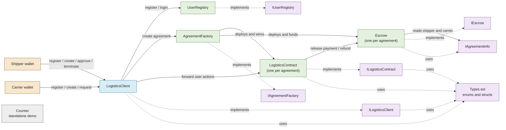

# Milestone Logistics Contracts

This directory contains the Solidity smart contracts for the milestone-based logistics escrow system. The contracts let registered shippers create funded agreements with carriers, manage milestone checkpoints, release ETH payouts, and refund remaining escrow when an agreement is terminated or a deadline is missed.

## Technology

- **Solidity `^0.8.34`** for the smart contracts.
- **Hardhat 3** for compilation, deployment, testing, and generated artifacts.
- **Hardhat Ignition** for deployment and one-time contract wiring.
- **ethers.js** for off-chain contract interaction and integration scripts.
- **forge-std-style Solidity tests** in `.t.sol` files, supported by Hardhat's Solidity test runner.

The default Hardhat configuration targets the London EVM. The production profile enables the optimizer and `viaIR`.

## Contracts

### `LogisticsClient`

The public application gateway and trusted caller-forwarder. It handles registration, login, agreement creation, agreement queries, checkpoint actions, termination, deadline checks, and transaction history.

It validates shipper and carrier roles and validates agreement schedules before calling the downstream contracts. Since downstream contracts receive `LogisticsClient` as `msg.sender`, it forwards the original user address as an explicit `caller` argument for user and role checks.

### `UserRegistry`

Stores wallet profiles, including email, name, and `UserRole`. It also enforces one-time registration and globally unique names. Only the configured `LogisticsClient` can register users or perform caller-specific login queries.

### `AgreementFactory`

Creates and indexes logistics agreements. For each agreement it deploys:

1. A `LogisticsContract` containing the agreement and milestone state.
2. An `Escrow` contract paired with that agreement.
3. The escrow funding transaction.

The factory connects and activates the agreement only after the escrow is fully funded, then indexes the agreement for both shipper and carrier.

### `LogisticsContract`

Represents one shipper-carrier agreement. It stores the participants, payout amounts, milestones, checkpoints, escrow address, and transaction history.

A carrier requests checkpoints and the shipper approves them. Once all checkpoints in a milestone are approved, the milestone payout is released to the carrier and the next milestone becomes active. The final completed milestone completes the agreement.

The agreement lifecycle is:

```text
Pending -> Activated -> Completed
                  \\-> Terminated
```

A milestone progresses as follows:

```text
Pending -> InProgress -> Completed
                      \\-> Failed
```

### `Escrow`

Holds native ETH for one agreement. Only its paired `LogisticsContract` can release milestone payments to the carrier or refund remaining funds to the shipper.

The escrow lifecycle is:

```text
Locked -> Released
       \\-> Refunded
```

### `Counter`

A standalone sample contract used by the frontend counter demo. It is not part of the logistics agreement flow.

## Interfaces and Shared Types

The files in `interfaces/` define the public contract APIs and shared data structures:

- `ILogisticsClient.sol` - public gateway API.
- `IUserRegistry.sol` - user registration and profile API.
- `IAgreementFactory.sol` - agreement creation and indexing API.
- `ILogisticsContract.sol` - agreement state, milestone actions, and lifecycle events.
- `IEscrow.sol` - escrow balance, funding, release, and refund API.
- `IAgreementInfo.sol` - narrow shipper and carrier view used by `Escrow` to resolve payees.
- `Types.sol` - enums and structs for users, agreements, milestones, checkpoints, and transactions.

The implementation contracts implement their corresponding interfaces. `LogisticsContract` is not explicitly declared as implementing `IAgreementInfo`; it satisfies that narrow interface structurally through its public `shipper()` and `carrier()` getters.

## Deployment and Wiring

The canonical deployment is defined in `../ignition/modules/Logistics.ts`:

```bash
npx hardhat build
npx hardhat ignition deploy ignition/modules/Logistics.ts --network ganache --reset
```

The deployment module:

1. Deploys `UserRegistry`.
2. Deploys `AgreementFactory`.
3. Deploys `LogisticsClient` with the registry and factory addresses.
4. Sets `LogisticsClient` as the trusted client on the registry and factory.

The `setClient` functions can only be called once. This establishes the trust boundary for calls from the application gateway.

## Main Data Flows

### User registration

```text
User wallet
  -> LogisticsClient.register(...)
  -> UserRegistry.register(user wallet, ...)
  -> UserProfile stored
```

### Agreement creation

```text
Shipper wallet
  -> LogisticsClient.createAgreement(..., ETH)
  -> validates users, roles, milestones, and deadlines
  -> AgreementFactory.createAgreement(..., ETH)
  -> deploys LogisticsContract and Escrow
  -> funds Escrow
  -> activates LogisticsContract
```

### Milestone payout

```text
Carrier requests checkpoint
  -> LogisticsClient
  -> LogisticsContract.requestCheckpoint(...)

Shipper approves checkpoint
  -> LogisticsClient
  -> LogisticsContract.approveCheckpoint(...)
  -> all checkpoints complete
  -> Escrow.releasePayment(amount)
  -> carrier receives ETH
```

### Termination or deadline failure

```text
Shipper termination or expired milestone
  -> LogisticsContract.terminateAgreement(...)
  -> Escrow.refund()
  -> remaining ETH returned to shipper
  -> agreement marked Terminated
```

`checkDeadlines` is externally triggered because Solidity contracts do not run scheduled jobs. Its `currentTime` argument is caller-supplied for local demonstration purposes and must not be treated as a secure production time source.

## Contract Diagram



## Development Commands

Run these commands from the repository root:

```bash
npx hardhat build
npx hardhat test solidity
npx tsc --noEmit
```

`artifacts/` and `cache/` are generated by Hardhat and should not be edited manually.
